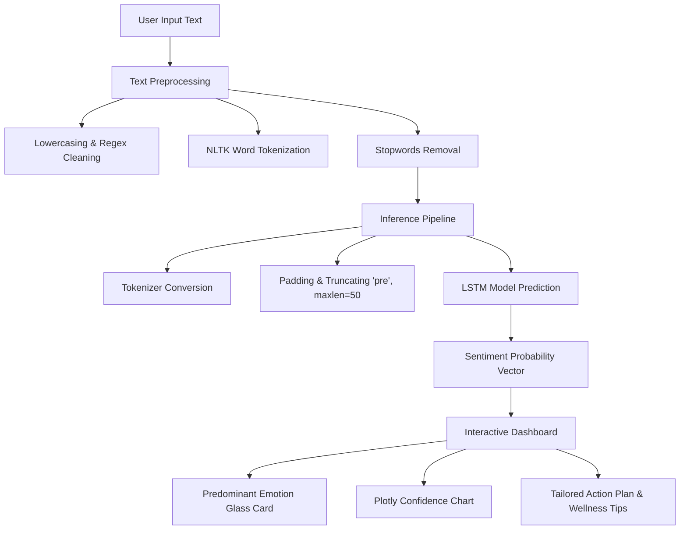

# 🧠 AI-Based Mental Health Sentiment Monitoring System

[](https://streamlit.io/)
[](https://tensorflow.org/)
[](https://www.nltk.org/)
[](https://plotly.com/)
[](https://opensource.org/licenses/MIT)

An advanced deep-learning sentiment analysis platform designed to detect, track, and provide positive wellness resources based on textual expressions. Driven by a sequence-learning LSTM neural network with masking features, the system classifies text into **7 distinct mental health categories** and presents findings in a glassmorphic dashboard.

---

## 📋 Table of Contents
- [System Architecture](#-system-architecture)
- [Key Features](#-key-features)
- [Technology Stack](#-technology-stack)
- [Installation & Setup](#-installation--setup)
- [Model Details](#-model-details)
- [Repository Structure](#-repository-structure)
- [Important Medical Disclaimer](#-important-medical-disclaimer)

---

## 🌀 System Architecture

The following diagram illustrates the data flow from the user's raw text input through NLP preprocessing and LSTM inference, culminating in the interactive dashboard visualization and tailored crisis action plan.



---

## ✨ Key Features

- **Sequence Learning LSTM Model**: Uses a Keras Long Short-Term Memory (LSTM) network designed for textual sequences, capturing semantic meaning and word relationships.
- **Signal-Loss Prevention (Masking)**: Incorporates zero-masking on the embedding layer to ignore padded indexes, resolving the "information dilution" issue that commonly biases short statements (e.g. *"I feel sad"*) towards neutral classes.
- **7 Mental Health States Tracked**:
  - 🌪️ **Anxiety**: Mild to high anxiety and uneasiness.
  - 🌓 **Bipolar**: Mood oscillations and energy swings.
  - ☁️ **Depression**: Persistent low mood and depressive feelings.
  - ☀️ **Normal**: Stable, joyful, and balanced states.
  - 🎭 **Personality Disorder**: Complex emotional intensities and shifts.
  - ⚖️ **Stress**: Cognitive overload and tension.
  - 🚨 **Suicidal**: Critical distress / high crisis state.
- **Premium User Interface**: Modern dark-themed dashboard equipped with:
  - **Ambient orb-bounce background animations** creating an atmospheric layout.
  - **3D perspective tilt hover effects** on information cards.
  - **Dynamic glowing pulse shadows** matching the active sentiment colors (e.g. crimson glow for crisis state, emerald green for stable).
  - **Plotly Express chart** showing full confidence score distribution.
- **Tailored Guidance System**: Renders a unique action plan, motivational messages, positive micro-activities, and self-care tips dynamically depending on the predicted sentiment.

---

## 💻 Technology Stack

- **Frontend Interface**: [Streamlit](https://streamlit.io/) (High-performance web dashboard framework)
- **Deep Learning Core**: [TensorFlow](https://www.tensorflow.org/) & [Keras](https://keras.io/)
- **Text Preprocessing**: [NLTK](https://www.nltk.org/) (Natural Language Toolkit)
- **Interactive Visualizations**: [Plotly Express](https://plotly.com/python/)
- **Data Pipelines**: [Pandas](https://pandas.pydata.org/), [NumPy](https://numpy.org/), [scikit-learn](https://scikit-learn.org/)

---

## 🚀 Installation & Setup

Follow these steps to run the application locally on your machine:

### 1. Clone the Repository
```bash
git clone https://github.com/BharathReddyRamasani/AI-Based-Mental-Health-Sentiment-Monitoring-System.git
cd AI-Based-Mental-Health-Sentiment-Monitoring-System
```

### 2. Set Up a Virtual Environment
It is highly recommended to use a virtual environment to manage dependencies:
```bash
# Windows
python -m venv venv
venv\Scripts\activate

# macOS / Linux
python3 -m venv venv
source venv/bin/activate
```

### 3. Install Dependencies
```bash
pip install -r requirements.txt
```

### 4. Download Preprocessors & Assets
The application requires the model weight file `upgraded_RNN_model.h5`, `tokenizer.pkl`, and `label_encoder.pkl` to be present in the root directory. NLTK resources (`stopwords`, `punkt`) will download automatically on first run.

### 5. Launch the Dashboard
```bash
streamlit run app.py
```
After executing, the dashboard will open automatically in your browser at `http://localhost:8501`.

---

## 🧠 Model Details

The backend neural network classifier was trained on a comprehensive mental health dataset mapping text statements to psychological classifications.

*   **Embeddings Layer**: Maps vocabulary words (34k+ tokens) to dense vectors, configured with `mask_zero=True` to ignore prepended zeros.
*   **LSTM Recurrent Layer**: Processes input sequence recursively, retaining memory of previous word signals.
*   **Dense Outputs**: Fully connected classification layer utilizing Softmax activation to compute the probability distribution across all 7 target classes.
*   **Text Preprocessing**: Normalizes inputs by removing punctuation and numbers, stripping out common stop words, tokenizing into individual words, and padding sequences to a uniform length of 50.

---

## 📂 Repository Structure

```
├── .gitignore               # Configured git exclusions (caches, environments)
├── README.md                # Professional project documentation
├── app.py                   # Main Streamlit application file (UI & Inference)
├── train_model.py           # Python model training script (LSTM architecture)
├── requirements.txt         # Project python dependencies
├── tokenizer.pkl            # Trained tokenizer asset
├── label_encoder.pkl        # Encoded target class labels mapping
└── upgraded_RNN_model.h5    # Compiled TensorFlow LSTM weights
```

---

## ⚠️ Important Medical Disclaimer

> [!WARNING]
> **This platform is not a clinical diagnostic tool.**
> The classifications and guidance provided by this AI system are for informational and self-monitoring purposes only. They are not intended to replace professional psychiatric, psychological, or medical counseling, diagnosis, or treatment. 
> 
> If you or someone you know is in deep distress or experiencing suicidal ideation, please connect with support immediately:
> - **In the US/Canada**: Call or text **988** to reach the Suicide & Crisis Lifeline.
> - **In the UK**: Call **111** to reach NHS mental health services, or call the Samaritans at **116 123**.
> - **Global**: Contact your local emergency services or visit [findahelpline.com](https://findahelpline.com) to find free, confidential support in your country.